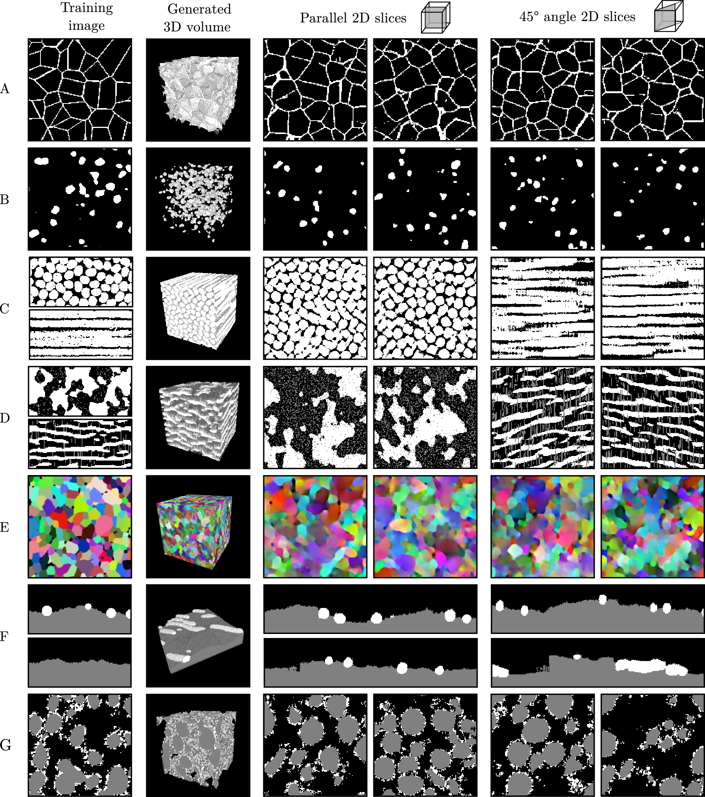

# SliceGAN 

To use SliceGAN open run_slicegan and edit information as requested. SliceGAN requires a single 2D training image of an isotropic microstructure, or three 2D images taken at perpendicular angles of an anisotropic microstructure. Images can be colour, grayscale or n-phase.

Use 'python run_slicegan 1' to train a new generator or 'python run_slicegan 0' to generate and save an example .tif file

### Development

If you are interested in trying new architectures, see the networks.py file

To adjust the training parameters or algorithm, see train.py

To add a new preprocessing method e.g for a different training datatype, see preproccessing.py.

### Results



### Quickstart Instructions

#### Python
Create a virtual environment

```
python -m venv venv
source venv/bin/activate
```
Install prerequisite packages
```
pip install -r requirements.txt
```

### Versions

v1.1 release: [](https://doi.org/10.5281/zenodo.4399114)

v1.0 release: [](https://doi.org/10.5281/zenodo.4319988)

